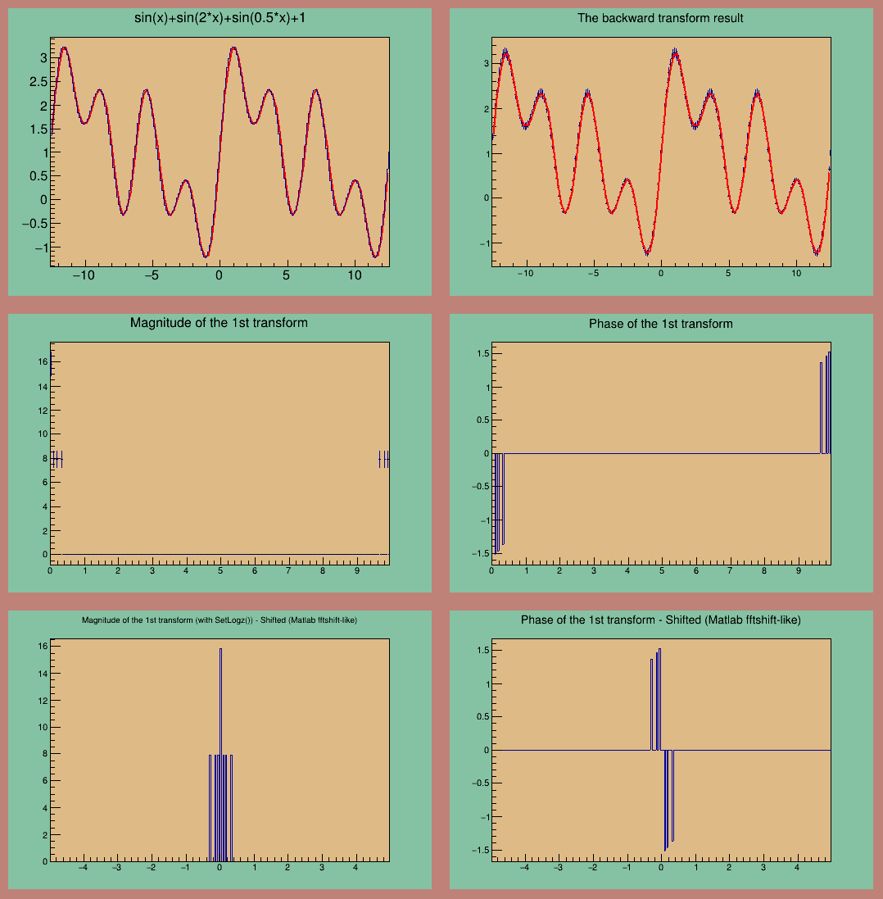
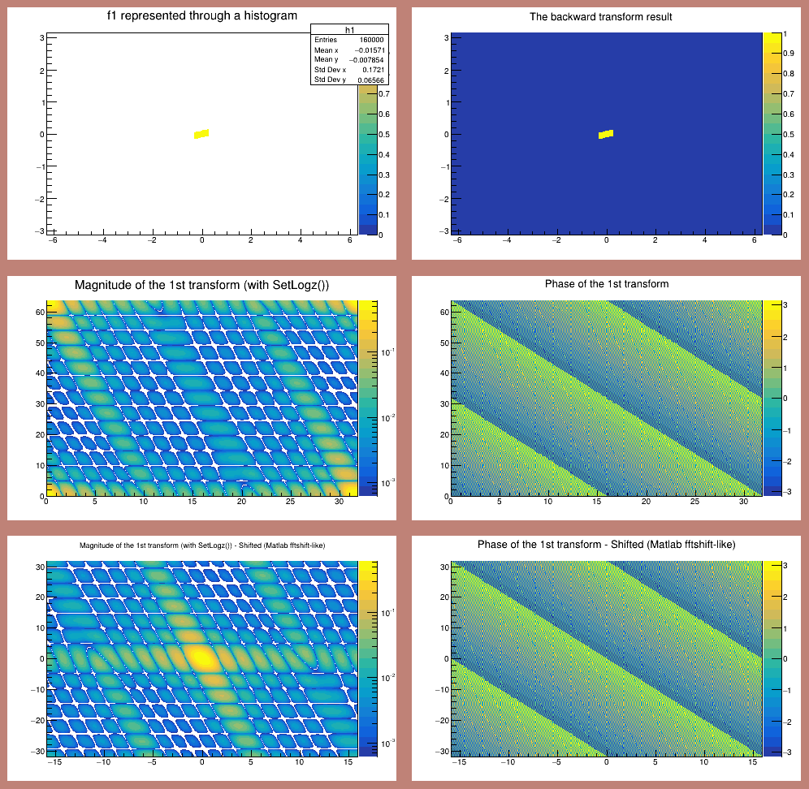

## FFT in ROOT/CERN

A simple program to check how FFT works in ROOT/CERN

ACHTUNG! This has been written by `past-me` in 2014, do not judge! I know that it is full of italian and that the parameter setting is awful, I know.


## Examples

1-dimensional function



2-dimensional step function



## Run and replicate the result

```bash
docker run \
  -v $PWD:/src \
  -v ~/temp/docker-root/:/root: \
  -e DISPLAY=$DISPLAY \
  -v /tmp/.X11-unix:/tmp/.X11-unix \
  --user (id -u):(id -g) \
  --rm -it \
  rootproject/root bash

g++ -o fft2d fft2d.cpp `root-config --cflags --glibs`
./fft2d

g++ -o fft fft.cpp `root-config --cflags --glibs`
./fft

```

